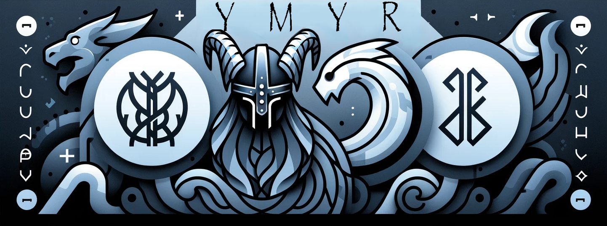

# Ymir Programming Language
<p align="center">
  
</p>

Ymir is a modern programming language inspired by Norse mythology, designed to be powerful and efficient for machine learning systems. Ymir aims to provide an intuitive syntax and robust features to make developing complex applications easier.

## Features

- **Intuitive Syntax:** Ymir offers a clean and readable syntax that makes it easy to learn and use.
- **Standard Library:** Includes a comprehensive standard library for various tasks, from basic operations to advanced data manipulation.
- **Module System:** Supports a flexible module system for code organization and reuse.
- **Type Safety:** Strongly typed language with type inference and checking to catch errors early.
- **Interoperability:** Seamless integration with existing libraries and tools, supporting the latest Python versions.
- **Cross-Platform:** Build and run Ymir scripts on Linux, macOS, and Windows.

## Installation

To install Ymir, use the package manager [Poetry](https://python-poetry.org/):

```bash
pip install poetry
```

Clone the repository and install dependencies:

```bash
git clone https://github.com/bjornaer/ymir.git
cd ymir
poetry install
```

## Usage
### Running Ymir Scripts
You can run Ymir scripts using the ymir command:
```bash
poetry run ymir run examples/main.ymr
```

### Building Ymir Scripts
Ymir supports building scripts into binaries. This is useful for distributing applications without requiring users to have Ymir installed.
```bash
poetry run ymir build examples/main.ymr dist/main
```

### Installing Dependencies
To install dependencies for your Ymir project, use:
```bash
poetry run ymir install --file ymir_dependencies.toml
```

### Contributing
We welcome contributions to Ymir! Please read our CONTRIBUTING.md for guidelines on how to contribute.

### License
Ymir is licensed under the MIT License. See the LICENSE file for more information.

### Contact
For any questions or feedback, please feel free to open an issue or contact us at max.schulkin@gmail.com.


